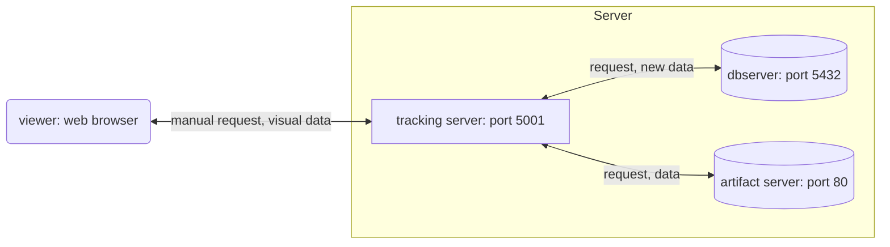

# Usage

docker vulumeの名前はmlflowv3にしている．コンフリクトが発生した場合は適宜変更すること．その場合，このページのmlflowv3を別のボリューム名に変更すること．

## 1.docker volumeを作成する．

```sh
docker volume create mlflowv3
```

## 2.コンテナを起動する．

```sh
docker-compose up -d
```

ログを確認してコンテナが起動していることを確認する．
確認出来たらCTRL+cでログを閉じる．

```sh
docker-compose logs --follow
```

[qiitaの記事](https://qiita.com/c60evaporator/items/e1fd57a0263a19b629d1#%E3%82%B7%E3%83%8A%E3%83%AA%E3%82%AA4-mlflow-with-remote-tracking-server-backend-and-artifact-stores)からftp-serverをローカルで作成するように変更した．
.envは適当に作成すること．

## **ちょっと重要** : データベースのファイルに直にアクセスする．

今の設定ではボリューム保存されたデータファイルに直にアクセスするのが難しい．
そのため，データファイルをデバッグするときなど，下のコマンドでコンテナ内に入る．
適宜コンテナ名を変更すること．\
`docker-compose exec`ではなぜかshが立ち上がらなかった．

```sh
docker exec -it db-server sh
```

上のコマンドでコンテナに入った後，`/var/lib/mysql`(postgressを使う場合はたぶん`/var/lib/postgres/data`)でデータベースのファイルをデバッグするか，下のコマンドでマウントしたホストのディレクトリにデータベースのファイルをコピーする．

```sh
cp -r /var/lib/mysql /data_backup
```

## **重要** : エラーとかでコンテナを再作成する場合

docker-compose.yamlそのままの設定ではデータベースが空のデータベースで初期化される．
逆に/var/lib/mysqlにデータが存在するとき**初期化できずにエラー落ちする．**
そのため以下のコードでボリュームを再生成する．
当然ボリュームの中のデータは全て破棄される．
データのバックアップを取りたいときは[上](#**ちょっと重要**-:-データベースのファイルに直にアクセスする．)を参考に．

```sh
docker volume rm mlflowv3
docker volume create mlflowv3
```

## 構成



## 参考

https://qiita.com/c60evaporator/items/e1fd57a0263a19b629d1

